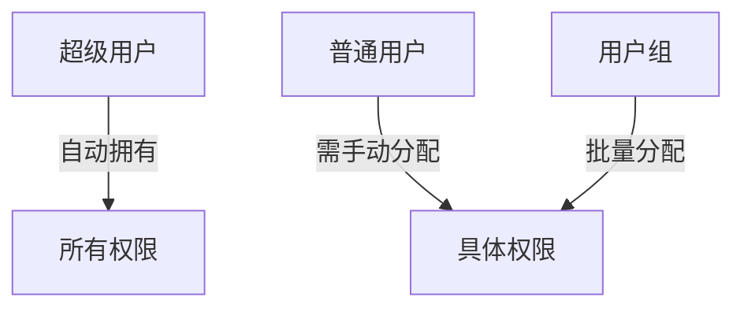

# Django Admin 默认权限系统

## 1. 默认权限类型
Django 为每个模型自动创建4种基础权限：
- **add**: 添加权限 (`模型名.add_模型名小写`)
- **view**: 查看权限 (`模型名.view_模型名小写`)  
- **change**: 修改权限 (`模型名.change_模型名小写`)
- **delete**: 删除权限 (`模型名.delete_模型名小写`)

## 2. 权限分配机制


## 3. 权限控制方式
### 3.1 用户级别控制
- 通过Admin后台的"用户"页面分配
- 可精确到每个模型的CRUD权限

### 3.2 组级别控制  
- 创建用户组并分配权限
- 用户加入组即获得组权限

### 3.3 代码级别控制
在ModelAdmin中可覆盖：
```python
def has_add_permission(self, request):
    return request.user.is_superuser

def has_change_permission(self, request, obj=None):
    return request.user.is_staff
```

## 4. 最佳实践
1. 生产环境应禁用DEBUG模式
2. 严格控制超级用户数量
3. 使用组管理常规权限
4. 敏感操作添加额外权限检查
